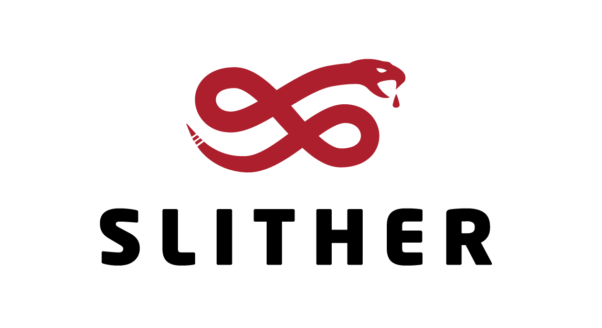

### 📝 Languages & Tools
---

  <!-- Frontend Column -->
  

    <strong>🎨 Frontend</strong>
    

      &nbsp;&nbsp;
      &nbsp;&nbsp;
      &nbsp;&nbsp;
      &nbsp;&nbsp;
      &nbsp;&nbsp;
      &nbsp;&nbsp;
      &nbsp;&nbsp;
      
    

  

  <!-- Backend Column -->
  

    <strong>⚙️ Backend</strong>
    

      &nbsp;&nbsp;
      &nbsp;&nbsp;
      &nbsp;&nbsp;
      
    

  

<strong>🛠️ Design & Development Tools</strong>

  &nbsp;&nbsp;&nbsp;&nbsp;
  &nbsp;&nbsp;&nbsp;&nbsp;
  &nbsp;&nbsp;&nbsp;&nbsp;
  &nbsp;&nbsp;&nbsp;&nbsp;
  

<strong>🔗 Web3 & Blockchain</strong>

  &nbsp;&nbsp;
  &nbsp;&nbsp;
  &nbsp;&nbsp;
  &nbsp;&nbsp;
  &nbsp;&nbsp;
  &nbsp;&nbsp;
  &nbsp;&nbsp;
  &nbsp;&nbsp;
  &nbsp;&nbsp;
  &nbsp;&nbsp;
  &nbsp;&nbsp;

<strong>🚀 Deployment & DevOps</strong>

  &nbsp;&nbsp;&nbsp;&nbsp;
  &nbsp;&nbsp;&nbsp;&nbsp;
  &nbsp;&nbsp;&nbsp;&nbsp;
  &nbsp;&nbsp;&nbsp;&nbsp;
  &nbsp;&nbsp;&nbsp;&nbsp;
  &nbsp;&nbsp;&nbsp;&nbsp;
  

### 📈 GitHub Activity
---

<picture>
  <source media="(prefers-color-scheme: dark)" srcset="https://raw.githubusercontent.com/edwardvey/edwardvey/output/github-contribution-grid-snake-dark.svg" />
  <source media="(prefers-color-scheme: light)" srcset="https://raw.githubusercontent.com/edwardvey/edwardvey/output/github-contribution-grid-snake.svg" />
  
</picture>

### 🗂️ Projects
---
